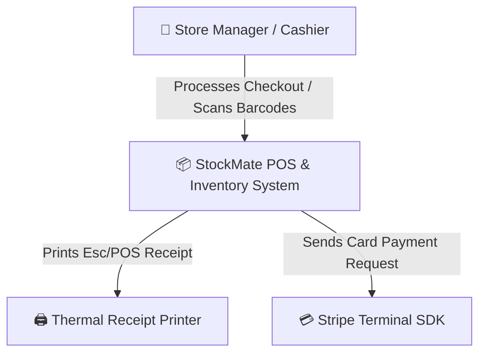
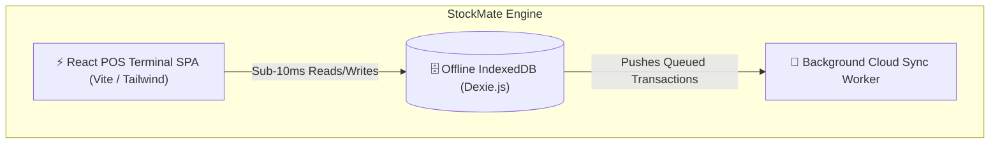

# StockMate (OmniStock) C4 Model System Architecture Diagrams

## Level 1: System Context Diagram

```mermaid
graph TD
    StoreManager["👤 Store Manager / Cashier"]
    StockMate["📦 StockMate POS & Inventory System"]
    ThermalPrinter["🖨️ Thermal Receipt Printer"]
    StripeTerminal["💳 Stripe Terminal SDK"]

    StoreManager -->|Processes Checkout / Scans Barcodes| StockMate
    StockMate -->|Prints Esc/POS Receipt| ThermalPrinter
    StockMate -->|Sends Card Payment Request| StripeTerminal
```

## Level 2: Container Diagram

```mermaid
graph TD
    subgraph StockMate_System ["StockMate Engine"]
        ReactPOS["⚡ React POS Terminal SPA (Vite / Tailwind)"]
        IndexedDB[("🗄️ Offline IndexedDB (Dexie.js)")]
        SyncEngine["🔄 Background Cloud Sync Worker"]
    end

    ReactPOS -->|Sub-10ms Reads/Writes| IndexedDB
    IndexedDB -->|Pushes Queued Transactions| SyncEngine
```
